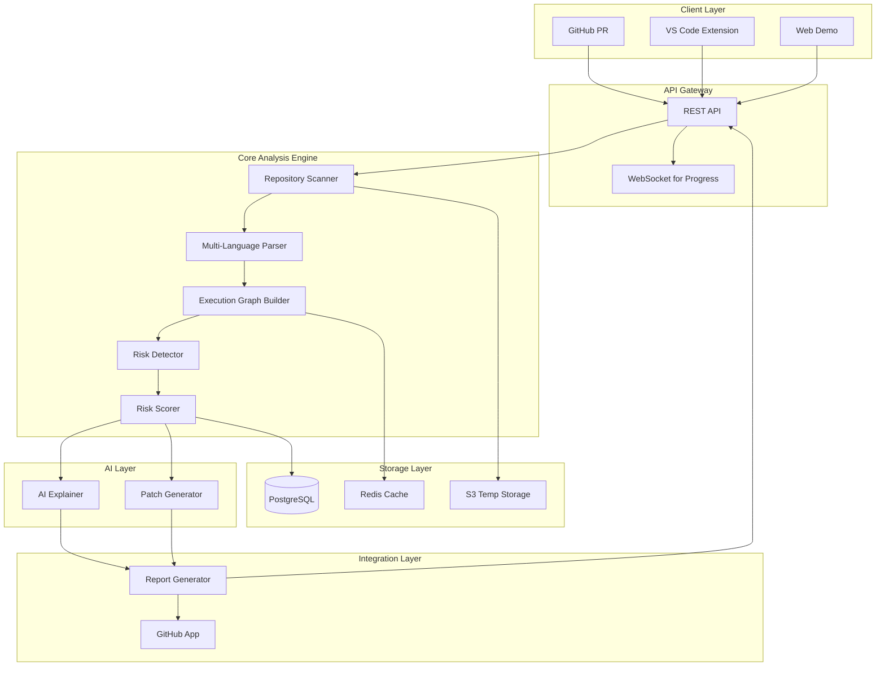
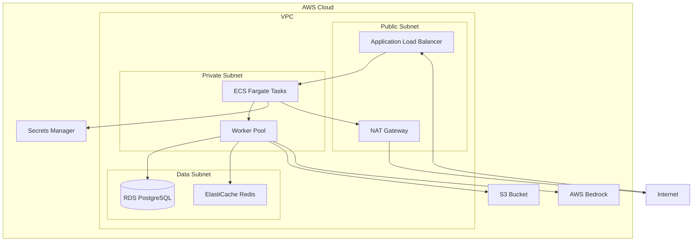

# Design Document: BlastShield

## Overview

BlastShield is an AI-augmented static analysis system that detects production-impact risks in code repositories before deployment. The system employs a deterministic rule-based engine for risk detection, augmented with AI for generating educational explanations and code patches.

The architecture follows a pipeline model:
1. Repository ingestion and parsing
2. Execution graph construction
3. Rule-based risk pattern detection
4. Deterministic risk scoring
5. AI-powered explanation and patch generation
6. Report generation and delivery

The system is designed for horizontal scalability, supporting multiple concurrent analyses while maintaining deterministic results. Integration points include GitHub webhooks, VS Code extension APIs, and a web-based demo interface.

## Architecture

### High-Level Architecture



### Component Responsibilities

**Client Layer:**
- GitHub PR: Webhook receiver for pull request events
- VS Code Extension: Local workspace scanner with IDE integration
- Web Demo: Public-facing sandbox for evaluation

**API Gateway:**
- REST API: Handles scan requests, authentication, and result retrieval
- WebSocket: Provides real-time progress updates for long-running scans

**Core Analysis Engine:**
- Repository Scanner: Clones repositories, filters relevant files
- Multi-Language Parser: Converts source code to ASTs (Python, JS, TS, Go)
- Execution Graph Builder: Constructs function-level call graphs with metadata
- Risk Detector: Applies deterministic rules to identify risk patterns
- Risk Scorer: Computes numeric risk scores using weighted rule engine

**AI Layer:**
- AI Explainer: Generates educational explanations using LLM (AWS Bedrock)
- Patch Generator: Creates minimal code patches using LLM with code context

**Storage Layer:**
- Redis Cache: Stores execution graphs and intermediate results
- PostgreSQL: Persists risk history, user data, scan metadata
- S3 Temp Storage: Temporarily stores cloned repositories (auto-delete after 24h)

**Integration Layer:**
- GitHub App: Posts comments, manages PR status checks
- Report Generator: Formats results as JSON and Markdown

### Deployment Architecture



**Deployment Strategy:**
- ECS Fargate for containerized API and worker services
- Auto-scaling based on queue depth and CPU utilization
- Multi-AZ deployment for high availability
- CloudWatch for monitoring and alerting
- AWS Bedrock for LLM inference (Claude or similar)

## Components and Interfaces

### 1. Repository Scanner

**Purpose:** Clone and prepare repositories for analysis

**Interface:**
```python
class RepositoryScanner:
    def scan_repository(self, repo_url: str, branch: str = "main") -> ScanResult:
        """
        Clone repository and extract source files
        
        Args:
            repo_url: Git repository URL (https or ssh)
            branch: Branch to analyze
            
        Returns:
            ScanResult containing file paths and metadata
            
        Raises:
            CloneError: If repository cannot be cloned
            SizeLimitError: If repository exceeds size limits
        """
        pass
    
    def scan_local(self, workspace_path: str) -> ScanResult:
        """
        Scan local workspace (for VS Code extension)
        
        Args:
            workspace_path: Absolute path to workspace
            
        Returns:
            ScanResult containing file paths and metadata
        """
        pass
```

**Implementation Details:**
- Uses `gitpython` library for cloning
- Filters files by extension (.py, .js, .ts, .go)
- Excludes common directories (node_modules, venv, .git)
- Enforces size limits (10k LOC for demo, 100k for production)
- Stores cloned repos in S3 with TTL metadata

### 2. Multi-Language Parser

**Purpose:** Parse source code into Abstract Syntax Trees

**Interface:**
```python
class MultiLanguageParser:
    def parse_file(self, file_path: str, language: str) -> AST:
        """
        Parse single source file into AST
        
        Args:
            file_path: Path to source file
            language: Language identifier (python, javascript, typescript, go)
            
        Returns:
            AST representation of the file
            
        Raises:
            ParseError: If file cannot be parsed
        """
        pass
    
    def parse_repository(self, scan_result: ScanResult) -> Dict[str, AST]:
        """
        Parse all files in scan result
        
        Args:
            scan_result: Result from RepositoryScanner
            
        Returns:
            Dictionary mapping file paths to ASTs
        """
        pass
```

**Implementation Details:**
- Python: Uses `ast` module from standard library
- JavaScript/TypeScript: Uses `@babel/parser` or `typescript` compiler API
- Go: Uses `go/parser` from standard library
- Graceful error handling: logs parse failures, continues with remaining files
- Normalizes AST structure across languages for uniform graph building

### 3. Execution Graph Builder

**Purpose:** Construct function-level call graphs from ASTs

**Interface:**
```python
class ExecutionGraphBuilder:
    def build_graph(self, asts: Dict[str, AST]) -> ExecutionGraph:
        """
        Build execution graph from parsed ASTs
        
        Args:
            asts: Dictionary mapping file paths to ASTs
            
        Returns:
            ExecutionGraph with nodes and edges
        """
        pass

class ExecutionGraph:
    def get_function_node(self, function_name: str) -> FunctionNode:
        """Get node by function name"""
        pass
    
    def get_callers(self, function_name: str) -> List[FunctionNode]:
        """Get all functions that call the specified function"""
        pass
    
    def get_callees(self, function_name: str) -> List[FunctionNode]:
        """Get all functions called by the specified function"""
        pass
    
    def traverse_from(self, start_node: str) -> Iterator[FunctionNode]:
        """Depth-first traversal from starting node"""
        pass
```

**Implementation Details:**
- Nodes represent functions/methods with metadata:
  - Function name and signature
  - File location (path, line number)
  - Async/sync indicator
  - Resource access patterns (DB, file I/O, network)
- Edges represent function calls with metadata:
  - Call site location
  - Conditional vs unconditional call
  - Error handling context (try/catch)
- Uses NetworkX for graph data structure
- Caches graphs in Redis for performance

### 4. Risk Detector

**Purpose:** Apply deterministic rules to identify risk patterns

**Interface:**
```python
class RiskDetector:
    def detect_risks(self, graph: ExecutionGraph) -> List[RiskPattern]:
        """
        Detect all risk patterns in execution graph
        
        Args:
            graph: Execution graph to analyze
            
        Returns:
            List of detected risk patterns
        """
        pass
    
    def detect_async_misuse(self, graph: ExecutionGraph) -> List[RiskPattern]:
        """Detect async/await misuse patterns"""
        pass
    
    def detect_race_conditions(self, graph: ExecutionGraph) -> List[RiskPattern]:
        """Detect potential race conditions"""
        pass
    
    def detect_idempotency_issues(self, graph: ExecutionGraph) -> List[RiskPattern]:
        """Detect missing idempotency safeguards"""
        pass
    
    def detect_resource_leaks(self, graph: ExecutionGraph) -> List[RiskPattern]:
        """Detect resource leak patterns"""
        pass
    
    def detect_partial_transactions(self, graph: ExecutionGraph) -> List[RiskPattern]:
        """Detect partial transaction risks"""
        pass
```

**Risk Detection Rules:**

**Async Misuse:**
- Async function called without await
- Blocking operation in async function
- Missing error handling in async chain
- Promise/Future not properly awaited

**Race Conditions:**
- Shared state access without synchronization
- Check-then-act pattern without locking
- Multiple async operations on same resource
- Non-atomic read-modify-write sequences

**Idempotency Issues:**
- HTTP POST/PUT without idempotency key
- Database insert without uniqueness constraint
- State mutation without version checking
- Retry logic without idempotency guarantee

**Resource Leaks:**
- File/connection opened without close in finally block
- Missing context manager usage (Python)
- Unclosed resources in error paths
- Infinite loop or unbounded recursion

**Partial Transactions:**
- Multiple database operations without transaction wrapper
- Mixed transactional and non-transactional operations
- Missing rollback in error handler
- External API call within database transaction

**Implementation Details:**
- Each rule is a separate function for modularity
- Rules are configurable via YAML files
- Rules output structured RiskPattern objects
- Deterministic execution order for reproducibility

### 5. Risk Scorer

**Purpose:** Compute deterministic numeric risk scores

**Interface:**
```python
class RiskScorer:
    def score_patterns(self, patterns: List[RiskPattern]) -> ScoredReport:
        """
        Compute risk scores for detected patterns
        
        Args:
            patterns: List of detected risk patterns
            
        Returns:
            ScoredReport with individual and aggregate scores
        """
        pass
    
    def compute_aggregate_score(self, pattern_scores: List[float]) -> float:
        """Compute repository-level aggregate score"""
        pass
    
    def categorize_severity(self, score: float) -> Severity:
        """Map numeric score to severity level"""
        pass
```

**Scoring Algorithm:**
```
Pattern Score = Base Weight × Confidence × Impact Multiplier

Base Weights:
- Async Misuse: 5
- Race Condition: 8
- Idempotency Issue: 7
- Resource Leak: 6
- Partial Transaction: 9

Confidence Factors:
- High confidence (clear violation): 1.0
- Medium confidence (likely violation): 0.7
- Low confidence (possible violation): 0.4

Impact Multipliers:
- In critical path (main, handler): 1.5
- In error handling: 1.3
- In background job: 1.0
- In test code: 0.5

Aggregate Score = Sum of all pattern scores

Severity Levels:
- Low: 0-20
- Medium: 21-50
- High: 51-80
- Critical: 81+
```

**Implementation Details:**
- Weights stored in configuration file
- Deterministic floating-point arithmetic
- Scores persisted to database for history tracking

### 6. AI Explainer

**Purpose:** Generate educational explanations of detected risks

**Interface:**
```python
class AIExplainer:
    def explain_pattern(self, pattern: RiskPattern, context: CodeContext) -> Explanation:
        """
        Generate human-readable explanation of risk pattern
        
        Args:
            pattern: Detected risk pattern
            context: Surrounding code context
            
        Returns:
            Explanation with description, scenario, and examples
        """
        pass
```

**Prompt Template:**
```
You are an expert software engineer explaining production risks to a developer.

Risk Pattern: {pattern_type}
Code Location: {file_path}:{line_number}
Code Snippet:
{code_snippet}

Explain:
1. What this pattern is and why it's risky
2. A concrete production scenario where this would fail
3. The consequences of this failure
4. How to recognize this pattern in the future

Use educational language appropriate for developers with 1-2 years of experience.
Be specific and concrete. Avoid jargon without explanation.
```

**Implementation Details:**
- Uses AWS Bedrock with Claude 3 Sonnet
- Temperature: 0.3 (low for consistency)
- Max tokens: 500 per explanation
- Caches explanations by pattern type + code hash
- Fallback to template-based explanations if LLM unavailable

### 7. Patch Generator

**Purpose:** Create minimal code patches to mitigate risks

**Interface:**
```python
class PatchGenerator:
    def generate_patch(self, pattern: RiskPattern, context: CodeContext) -> Patch:
        """
        Generate minimal code patch to fix risk
        
        Args:
            pattern: Detected risk pattern
            context: Surrounding code context
            
        Returns:
            Patch in unified diff format
        """
        pass
```

**Prompt Template:**
```
You are an expert software engineer creating a minimal, safe code patch.

Risk Pattern: {pattern_type}
Original Code:
{code_snippet}

Generate a minimal patch that:
1. Fixes the identified risk
2. Preserves all existing functionality
3. Uses idiomatic {language} patterns
4. Includes necessary imports/dependencies
5. Adds comments explaining the fix

Output the patch in unified diff format.
```

**Implementation Details:**
- Uses AWS Bedrock with Claude 3 Sonnet
- Temperature: 0.2 (very low for safety)
- Max tokens: 800 per patch
- Validates patch syntax before returning
- Includes confidence score for patch quality
- Manual review recommended for Critical severity

### 8. Report Generator

**Purpose:** Format analysis results for consumption

**Interface:**
```python
class ReportGenerator:
    def generate_json_report(self, scored_report: ScoredReport, 
                            explanations: List[Explanation],
                            patches: List[Patch]) -> str:
        """Generate JSON report for programmatic consumption"""
        pass
    
    def generate_markdown_report(self, scored_report: ScoredReport,
                                explanations: List[Explanation],
                                patches: List[Patch]) -> str:
        """Generate Markdown report for human review"""
        pass
```

**Report Structure (JSON):**
```json
{
  "scan_id": "uuid",
  "repository": "owner/repo",
  "branch": "main",
  "timestamp": "2024-01-15T10:30:00Z",
  "aggregate_score": 45.5,
  "severity": "Medium",
  "patterns": [
    {
      "id": "pattern-1",
      "type": "async_misuse",
      "score": 7.5,
      "location": {
        "file": "src/handler.py",
        "line": 42,
        "function": "process_request"
      },
      "explanation": "...",
      "patch": "...",
      "confidence": "high"
    }
  ],
  "summary": {
    "total_patterns": 5,
    "by_type": {
      "async_misuse": 2,
      "race_condition": 1,
      "resource_leak": 2
    },
    "by_severity": {
      "critical": 0,
      "high": 1,
      "medium": 3,
      "low": 1
    }
  }
}
```

**Report Structure (Markdown):**
```markdown
# BlastShield Analysis Report

**Repository:** owner/repo  
**Branch:** main  
**Scan Date:** 2024-01-15 10:30:00 UTC  
**Overall Risk Score:** 45.5 (Medium)

## Summary

- Total Patterns Detected: 5
- Critical: 0 | High: 1 | Medium: 3 | Low: 1

## Detected Risks

### 1. Async Misuse in `src/handler.py:42`

**Severity:** Medium (Score: 7.5)  
**Function:** `process_request`

**Explanation:**
[AI-generated explanation]

**Recommended Fix:**
```diff
[Unified diff patch]
```

---

[Additional patterns...]
```

## Data Models

### Core Data Structures

**ScanResult:**
```python
@dataclass
class ScanResult:
    scan_id: str
    repository_url: str
    branch: str
    commit_hash: str
    file_paths: List[str]
    total_lines: int
    language_breakdown: Dict[str, int]
    scan_timestamp: datetime
```

**FunctionNode:**
```python
@dataclass
class FunctionNode:
    name: str
    qualified_name: str  # module.class.function
    file_path: str
    line_number: int
    is_async: bool
    parameters: List[Parameter]
    return_type: Optional[str]
    resource_accesses: List[ResourceAccess]
    error_handling: ErrorHandlingInfo
```

**ResourceAccess:**
```python
@dataclass
class ResourceAccess:
    resource_type: str  # "database", "file", "network", "cache"
    operation: str  # "read", "write", "delete"
    is_transactional: bool
    has_cleanup: bool
```

**RiskPattern:**
```python
@dataclass
class RiskPattern:
    pattern_id: str
    pattern_type: str  # "async_misuse", "race_condition", etc.
    severity: str
    confidence: str  # "high", "medium", "low"
    location: Location
    code_snippet: str
    affected_functions: List[str]
    detection_rule: str
```

**Location:**
```python
@dataclass
class Location:
    file_path: str
    line_number: int
    column_number: int
    function_name: str
```

**ScoredReport:**
```python
@dataclass
class ScoredReport:
    scan_id: str
    patterns: List[Tuple[RiskPattern, float]]  # (pattern, score)
    aggregate_score: float
    severity: str
    pattern_counts: Dict[str, int]
```

**Explanation:**
```python
@dataclass
class Explanation:
    pattern_id: str
    description: str
    production_scenario: str
    consequences: str
    learning_points: List[str]
    generated_at: datetime
```

**Patch:**
```python
@dataclass
class Patch:
    pattern_id: str
    diff: str  # Unified diff format
    confidence: float
    requires_manual_review: bool
    additional_notes: str
```

### Database Schema

**scans table:**
```sql
CREATE TABLE scans (
    scan_id UUID PRIMARY KEY,
    repository_url VARCHAR(500) NOT NULL,
    branch VARCHAR(200) NOT NULL,
    commit_hash VARCHAR(40) NOT NULL,
    user_id UUID REFERENCES users(user_id),
    aggregate_score DECIMAL(5,2),
    severity VARCHAR(20),
    total_patterns INTEGER,
    scan_timestamp TIMESTAMP NOT NULL,
    completion_timestamp TIMESTAMP,
    status VARCHAR(20), -- 'pending', 'running', 'completed', 'failed'
    error_message TEXT,
    INDEX idx_repo_timestamp (repository_url, scan_timestamp),
    INDEX idx_user_timestamp (user_id, scan_timestamp)
);
```

**patterns table:**
```sql
CREATE TABLE patterns (
    pattern_id UUID PRIMARY KEY,
    scan_id UUID REFERENCES scans(scan_id) ON DELETE CASCADE,
    pattern_type VARCHAR(50) NOT NULL,
    severity VARCHAR(20) NOT NULL,
    confidence VARCHAR(20) NOT NULL,
    score DECIMAL(5,2) NOT NULL,
    file_path VARCHAR(500) NOT NULL,
    line_number INTEGER NOT NULL,
    function_name VARCHAR(200),
    code_snippet TEXT,
    explanation TEXT,
    patch TEXT,
    INDEX idx_scan_patterns (scan_id),
    INDEX idx_pattern_type (pattern_type)
);
```

**users table:**
```sql
CREATE TABLE users (
    user_id UUID PRIMARY KEY,
    github_username VARCHAR(100) UNIQUE,
    email VARCHAR(255),
    oauth_token_hash VARCHAR(255),
    created_at TIMESTAMP NOT NULL,
    last_login TIMESTAMP,
    subscription_tier VARCHAR(20) -- 'free', 'pro', 'enterprise'
);
```

**repositories table:**
```sql
CREATE TABLE repositories (
    repo_id UUID PRIMARY KEY,
    repository_url VARCHAR(500) UNIQUE NOT NULL,
    owner_user_id UUID REFERENCES users(user_id),
    first_scan_timestamp TIMESTAMP,
    last_scan_timestamp TIMESTAMP,
    total_scans INTEGER DEFAULT 0,
    INDEX idx_owner (owner_user_id)
);
```


## Correctness Properties

A property is a characteristic or behavior that should hold true across all valid executions of a system—essentially, a formal statement about what the system should do. Properties serve as the bridge between human-readable specifications and machine-verifiable correctness guarantees.

### Property 1: Repository Scanning Completeness

*For any* valid repository containing source files in supported languages (Python, JavaScript, TypeScript, Go), scanning should successfully parse all valid source files and return a structured representation containing all file paths.

**Validates: Requirements 1.1, 1.2, 1.4**

### Property 2: Parsing Error Resilience

*For any* repository containing a mix of valid and invalid source files, the scanner should continue processing all files, log errors for unparseable files, and return results for successfully parsed files.

**Validates: Requirements 1.3, 15.2**

### Property 3: Execution Graph Completeness

*For any* set of parsed ASTs, the execution graph builder should identify all function definitions and create directed edges for all function call relationships, with async functions properly marked in metadata.

**Validates: Requirements 2.1, 2.2, 2.3, 2.4**

### Property 4: Graph Query Consistency

*For any* valid execution graph, query operations (get_callers, get_callees, traverse_from) should return consistent results that respect the graph structure.

**Validates: Requirements 2.5**

### Property 5: Risk Pattern Detection Coverage

*For any* execution graph containing known risk patterns (async misuse, race conditions, idempotency issues, resource leaks, partial transactions), the risk detector should identify all instances of each pattern type.

**Validates: Requirements 3.1, 3.2, 3.3, 3.4, 3.5**

### Property 6: Risk Detection Output Structure

*For any* detected risk pattern, the output should include file location, line number, function name, and pattern type.

**Validates: Requirements 3.6**

### Property 7: Deterministic Analysis

*For any* code repository, analyzing the same code multiple times (on the same or different machines) should produce identical risk patterns and identical risk scores.

**Validates: Requirements 3.7, 4.1, 4.4, 12.1, 12.2, 12.3**

### Property 8: Risk Score Ordering

*For any* set of detected risk patterns, patterns with higher production impact (partial transactions, race conditions) should receive higher scores than patterns with lower impact (resource leaks in test code).

**Validates: Requirements 4.2**

### Property 9: Aggregate Score Computation

*For any* set of individual pattern scores, the aggregate repository risk score should be computed consistently and map to exactly one severity level (Low, Medium, High, Critical).

**Validates: Requirements 4.3, 4.5**

### Property 10: Report Completeness

*For any* completed risk analysis, the generated report should include: aggregate score, severity level, risk score breakdown by pattern type, failure mode descriptions for each risk, and patch recommendations for each risk.

**Validates: Requirements 5.1, 5.2, 5.3, 5.5**

### Property 11: Report Serialization Round-Trip

*For any* generated Blast Report, serializing to JSON and deserializing should produce an equivalent report structure, and the JSON should be valid and parseable.

**Validates: Requirements 5.6**

### Property 12: Markdown Report Validity

*For any* generated Blast Report, the Markdown output should be valid Markdown containing all required sections (summary, detected risks, patches).

**Validates: Requirements 5.7**

### Property 13: AI Explanation Generation

*For any* detected risk pattern, the AI explainer should generate a non-empty explanation containing key terms related to the pattern type.

**Validates: Requirements 6.1**

### Property 14: Patch Format Validity

*For any* generated patch, it should be formatted as valid unified diff format that can be parsed by standard diff tools.

**Validates: Requirements 7.1, 7.5**

### Property 15: Fallback Guidance Provision

*For any* risk pattern where automatic patch generation fails, the system should provide manual remediation guidance text.

**Validates: Requirements 7.4**

### Property 16: GitHub PR Status Logic

*For any* completed analysis, if high or critical risks are detected, the PR status should be set to failure (blocking merge); if only low or medium risks are detected, the PR status should be success with warnings.

**Validates: Requirements 8.3, 8.4**

### Property 17: VS Code Problems Panel Integration

*For any* completed local analysis with detected risks, all risks should appear in the VS Code Problems panel with correct file locations.

**Validates: Requirements 9.3**

### Property 18: VS Code Quick Fix Availability

*For any* detected risk with an available patch, the VS Code extension should provide a quick fix action.

**Validates: Requirements 9.5**

### Property 19: Offline Analysis Support

*For any* local workspace, the VS Code extension should complete analysis without requiring network connectivity.

**Validates: Requirements 9.6**

### Property 20: Demo Size Validation

*For any* repository submitted to the demo sandbox, if the repository exceeds 5,000 lines of code, it should be rejected with a descriptive error message.

**Validates: Requirements 10.2, 10.4**

### Property 21: Demo Rate Limiting

*For any* IP address, the 11th scan request within a 60-minute window should be rejected with a rate limit error.

**Validates: Requirements 10.5**

### Property 22: Risk History Persistence

*For any* completed repository scan, the risk score and timestamp should be stored in the risk history database.

**Validates: Requirements 11.1**

### Property 23: Risk History Comparison

*For any* two consecutive scans of the same repository, the system should correctly identify which risk patterns were introduced, resolved, or unchanged between scans.

**Validates: Requirements 11.3, 11.4**

### Property 24: Log Privacy

*For any* log entry generated by the system, it should not contain source code content from analyzed repositories.

**Validates: Requirements 14.5**

### Property 25: Error Message Quality

*For any* error condition (clone failure, parse failure, internal error), the system should return a descriptive, user-friendly error message and log the technical details separately.

**Validates: Requirements 15.1, 15.2, 15.3**

## Error Handling

### Error Categories

**Input Validation Errors:**
- Invalid repository URL format
- Unsupported programming language
- Repository size exceeds limits
- Rate limit exceeded

**Runtime Errors:**
- Repository clone failure (network, authentication)
- Parse errors in source files
- Graph construction failures
- AI service unavailable

**System Errors:**
- Database connection failures
- Cache unavailable
- Storage service errors
- Internal exceptions

### Error Handling Strategy

**Graceful Degradation:**
- Continue analysis when individual files fail to parse
- Provide partial results when complete analysis is impossible
- Fall back to template explanations when AI service is unavailable
- Return cached results when database is temporarily unavailable

**Error Response Format:**
```json
{
  "error": {
    "code": "PARSE_ERROR",
    "message": "Failed to parse 3 files in repository",
    "details": {
      "failed_files": ["src/broken.py", "lib/invalid.js", "main.go"],
      "parse_errors": ["Syntax error at line 42", "..."]
    },
    "partial_results": {
      "successfully_parsed": 47,
      "risks_detected": 5
    },
    "user_action": "Review the failed files and ensure they contain valid syntax"
  }
}
```

**Logging Strategy:**
- ERROR level: System failures requiring immediate attention
- WARN level: Partial failures, degraded functionality
- INFO level: Normal operations, scan completions
- DEBUG level: Detailed execution traces (development only)
- Never log source code content or sensitive data

**Retry Logic:**
- Repository cloning: 3 retries with exponential backoff
- AI service calls: 2 retries with 1-second delay
- Database operations: 3 retries for transient failures
- No retries for validation errors or permanent failures

## Testing Strategy

### Dual Testing Approach

BlastShield employs both unit testing and property-based testing to ensure comprehensive correctness:

**Unit Tests:**
- Specific examples demonstrating correct behavior
- Edge cases (empty repositories, single-file repos, maximum size repos)
- Error conditions (invalid URLs, parse failures, network errors)
- Integration points (GitHub webhooks, VS Code API, database operations)
- Mock external dependencies (GitHub API, AWS Bedrock, S3)

**Property-Based Tests:**
- Universal properties that hold for all inputs
- Comprehensive input coverage through randomization
- Minimum 100 iterations per property test
- Each test references its design document property
- Tag format: **Feature: blastshield-core, Property {number}: {property_text}**

### Property-Based Testing Configuration

**Testing Library:** Use `hypothesis` for Python components, `fast-check` for TypeScript components

**Test Configuration:**
```python
# Python example using hypothesis
from hypothesis import given, settings
import hypothesis.strategies as st

@settings(max_examples=100)
@given(repository=st.builds(generate_random_repository))
def test_property_1_scanning_completeness(repository):
    """
    Feature: blastshield-core, Property 1: Repository Scanning Completeness
    
    For any valid repository containing source files in supported languages,
    scanning should successfully parse all valid source files.
    """
    result = scanner.scan_repository(repository.url)
    
    expected_files = repository.get_source_files()
    assert len(result.file_paths) == len(expected_files)
    assert set(result.file_paths) == set(expected_files)
```

**Generator Strategies:**
- Random repository structures with varying sizes
- Random code snippets in each supported language
- Random execution graphs with varying complexity
- Random risk patterns embedded in code
- Random error conditions (network failures, parse errors)

### Test Coverage Requirements

- Minimum 80% code coverage for all components
- 100% coverage for risk detection rules
- 100% coverage for scoring algorithms
- All 25 correctness properties implemented as property tests
- Integration tests for all external integrations

### Testing Phases

**Phase 1: Unit Testing (During Development)**
- Test individual components in isolation
- Mock external dependencies
- Fast feedback loop for developers

**Phase 2: Property Testing (During Development)**
- Test universal properties with generated inputs
- Catch edge cases not covered by unit tests
- Validate determinism and consistency

**Phase 3: Integration Testing (Pre-Deployment)**
- Test component interactions
- Test with real external services (staging)
- Validate end-to-end workflows

**Phase 4: Performance Testing (Pre-Deployment)**
- Validate performance requirements (15s for 10k LOC)
- Load testing for concurrent scans
- Stress testing for resource limits

**Phase 5: Security Testing (Pre-Deployment)**
- Penetration testing
- Vulnerability scanning
- Compliance validation (SOC 2)

### Continuous Integration

- All tests run on every commit
- Property tests run with reduced iterations (20) for speed
- Full property test suite (100 iterations) runs nightly
- Integration tests run on staging environment
- Deployment blocked if any tests fail

